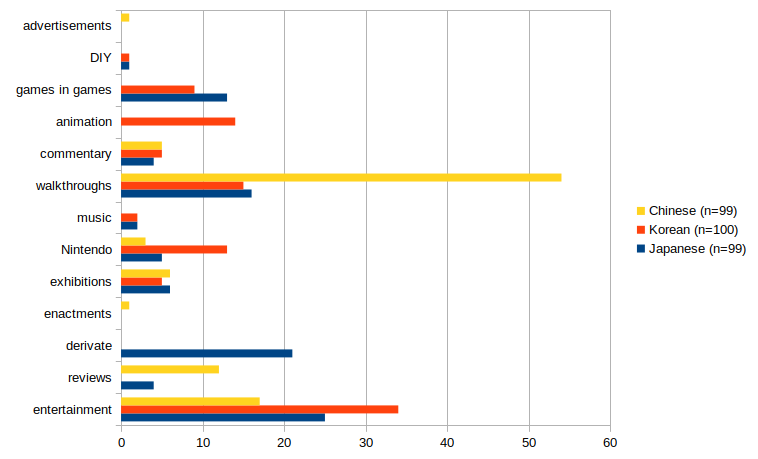
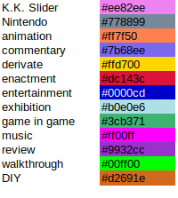

# Atsumori 2025
This website supplements the publication "Playing with Animal Crossing: New Horizons in the Japanese, Korean and Chinese YouTube Space", published in  Handbook of Japanese Games (ed. Rachael Hutchinson, MHM Limited 2025), with full-color figures, tables, and interactive network visualizations. They are presented in the order of appearance in the chapter.
In order to explore the data directly, please visit the GitHub repository. This research was funded by the JSPS in the context of the project “Exploratory Research on Play and Communities on Video Streaming Platforms” (22K18155).  

### Chapter summary:
Videogame play extends beyond the game world. It takes place in digital spaces such as wikis, blogs, or video streaming and sharing platforms. Being more than mere “paratexts,” these spaces are playgrounds in their own right. Players and users appropriate these spaces to negotiate and constitute videogame culture. This chapter asks how the widely popular game Animal Crossing: New Horizons (Nintendo 2020) in particular is played on the video sharing platform YouTube, focusing on the Japanese, Korean and Chinese language spaces. Examining the 100 most popular videos about the game on YouTube in each language space, I first identify several differences between them in terms of content preferences. In a second step, I apply a network analysis to the user comments on these videos to show how YouTube both strengthens lingual, national and game cultural boundaries, and serves to open up a transnational space for playing with Animal Crossing.

### Figure 10.1 Distribution of Categories in the Sampled Videos, Compared by Language.

For the data, see this [table](tables/Roth_Table10.0_Data_ACNHYouTube_CountryComparison_Stats.csv)

### Figure 10.2 Network Visualization of all Sampled Videos based on Shared User Comments, Colored by Language (jp = orange, ko = green, ch = purple), Node Size based on Weighted Degree, Labels are YouTube Video IDs.

Explore this network in the [interactive version](https://ouestware.gitlab.io/retina/beta/#/graph/?url=https://gist.githubusercontent.com/m4chi/3e12532ff2529036581f8eed219555f4/raw/5db0ccf40b453c40976cc0fbe3005f640bfe372a/network-1e185694-905.gexf), and also have a look at an [alternative color schema based on the video categories](https://ouestware.gitlab.io/retina/beta/#/graph/?url=https://gist.githubusercontent.com/m4chi/2046fad48d325360e2b0904abc9a7b31/raw/218ed58f1d1efce9b849149c7eb33c982c6e24d8/network-53b77467-fcc.gexf). For the color codes, please refer to the following list:

  

### [Table 10.1 Ten Videos with the Highest Weighted Degree (wd) per Language, Including Categories](tables/Roth_Table10.1_CrossCountryComparisonWeightedDegree.csv)

| Japanese | wd | category | channel | Korean | wd | category | channel | Chinese | wd | category | channel |
| --- | --- | --- | --- | --- | --- | --- | --- | --- | --- | --- | --- |
| tM1eKXldWdk | 2482 | entertainment | HikakinGames | JM_bcMvK_S0 | 4744 | entertainment | Heun-han-nam-mae | I1lebC_9YMI | 539 | walkthrough | Wei Wei |
| n11w5Wb5jY8 | 2455 | entertainment | Ri’inu-kun no sabuchanneru! | RUSvx6R6Qas | 4591 | entertainment | Heun-han-nam-mae | zfoPBvy_u9o | 523 | walkthrough | Yu Le Lerü |
| 5n-CAMtzujo | 2190 | derivate | Chīnya channeru | GYMy0WkIXAA | 4349 | entertainment | Heun-han-nam-mae | KHjy79YbcH4 | 413 | review | An JiuMi |
| s07hc5RO4oM | 2143 | derivate | Chīnya channeru | MfirSV9azwQ | 3119 | walkthrough | Gong-lyong | UqqxbHisW8U | 391 | entertainment | NyoNyo Ri Chang Shi Kuang |
| FNf-TIU0xpk | 2041 | derivate | Chīnya channeru | I-jLrWcyNJw | 3115 | exhibition | Sseon-syas YouTube | XjjaHjFj1zY | 365 | walkthrough | Yu Le Lerü |
| fWMX7-MplXM | 2011 | entertainment | HikakinGames | 6FvvylWS5TU | 2774 | walkthrough | Gong-lyong | laa5QLoNvrY | 365 | walkthrough | Yu Le Lerü |
| UZ6NYuNW4Ng | 1970 | derivate | Chīnya channeru | xHgjyjV1c8c | 2773 | commentary | Ssom-ttamTV SsomDDam | KM4YSzC55YY | 349 | commentary | Dio Chan |
| fYPLEfo0uoI | 1875 | derivate | Chīnya channeru | 8pnz2ADkjY8 | 2689 | walkthrough | Gong-lyong | 7Fl_FuZKBB8 | 335 | entertainment | KIKI You Xi Shi Kuang |
| -Ww-2Ldji1k | 1845 | commentary | Yukkī GAME wārudo | f993Rta8tEg | 2618 | walkthrough | Gong-lyong | bfxjUX7bGzQ | 334 | entertainment | NyoNyo Ri Chang Shi Kuang |
| lzQQlFPY27Q | 1841 | derivate | Chīnya channeru | j-KaIWW55Ls | 2527 | music | Gong-lyong | zB_JOnIiV3s | 329 | review | Yu Le Lerü |  

### [Table 10.2 Fifteen Videos with the Highest Weighted Degree Commented on by Users who also Comment on Videos in Other Languages](tables/Roth_Table10.2_CrossCountryBridgesWeightedDegree.csv)

| Video id | language | wd | type | channel |
| --- | --- | --- | --- | --- |
| 7r8-DcNMUtw | ko | 291 | music | Minimel |
| BOWtHIlZS5M | ko | 235 | animation | sum |
| RjHYFeBgUgM | jp | 185 | commentary | Aho ga tsukutta dōga |
| j-KaIWW55Ls | ko | 114 | music | Minimel |
| sM9vpsmY-m4 | ko | 111 | DIY | Dal-lyeo-la-chi-kin Dalchi |
| X8bogf4-0Yo | ko | 101 | animation | sum |
| tM1eKXldWdk | jp | 98 | entertainment | HikakinGames |
| -Ww-2Ldji1k | jp | 98 | commentary | Yukkī GAME wārudo |
| L84nfJri27Y | ko | 92 | game in game | Ssom-ttamTV SsomDDam |
| _deDa_S-dQU | ko | 88 | animation | sum |
| uUjM1d2uo9c | ko | 88 | animation | Damomo |
| NeGqWuYxwx0 | ko | 85 | entertainment | Mae-dong-i ui jag-eun jib |
| I-jLrWcyNJw | ko | 80 | exhibition | Sseon-syas YouTube |
| ZVu5umw2_aw | ko | 80 | animation | sum |
| RrtHrMGKi4k | jp | 76 | entertainment | kokopy official |  

### Figure 10.3 Annotated Visualization of User Network, Users Related by Co-appearance in the Comments of a Video, Emphasized by Weighted Degree.

Explore this network in the [interactive version](networks/network10.3/index.html) (due to the number of nodes this visualization could not be made available as gist).  

### Meta
<!--- **Zenodo Repository Snapshots
 --->
**License**
[CC-BY 4.0](http://creativecommons.org/licenses/by/4.0)

**Copyright**
2025 Martin Roth [roth1003@fc.ritsumei.ac.jp](roth1003@fc.ritsumei.ac.jp)
